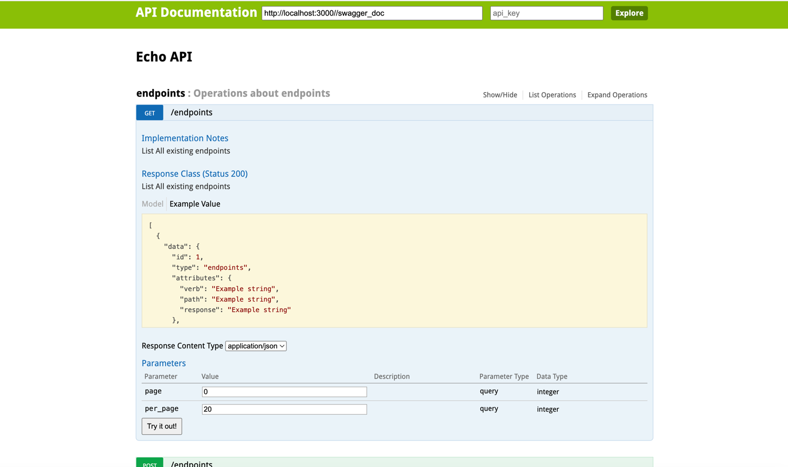

# Echo Server Implementation

- [Overall development plan](#overall-development-paln)
  - [Design](#design)
  - [Reasons behind frameworks and tools](#reasons-behind-frameworks-and-tools)
- [Usage](#usage)
  - [Server up](#server-up)
  - [Run tests](#run-tests)
- [Documentation](#documentation)

## Overall Development Plan
To speed Up the task development, and to make sure having an always up to date documentation, making sure the input validation layer is reliable, I decided to go forward with
[Grape](https://github.com/ruby-grape/grape).

For the mock functionality, I made use of grape [Handling 404](https://github.com/ruby-grape/grape#handling-404).

### Design

The server is layers as follows:

- `api/endpoints`: Implements all the endpoints, and the mock resolver, it is kept as slim as possible making sure it hands ever thing to a `service` after making sure the input is valid.
- `api/entities`: Serialize object into jsonapi format.
- `services`: The main business logic and error formatting logic to keep the apis simple, each service has one single responsibility.

### Reasons behind frameworks and tools
while the same Implementation could be done by grape mounted on rack and sequel to make it efficient and lighter.
the main motive to use rails is to speed up the implementation by the out of the box supporting tools (mainly to use activerecord).

## Usage

### Server up

```bash
$ docker-compose up --build  
```

### Run Tests

```bash
$ docker-compose run --build web bundle exec rspec
```

```bash
$ docker-compose run --build web rubocop
```

## Documentation

Using swagger with grape to auto-generate documentation.

```
http://localhost:3000/api/echo/docs
```

